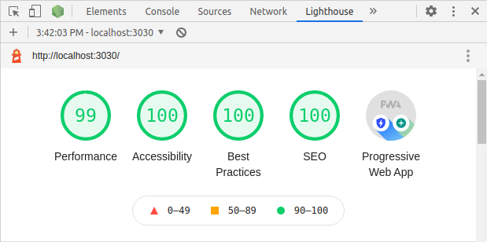

## Test Project Bootstrap

Tech stack:
- Docker (two separate containers App and MongoDB)
- Webpack 5
- Express
- React/Redux
- Server-side rendering (SSR)
- Bootstrap 5
- Sass
- Winston
- PWA
- Tuned with [Lighthouse](https://developers.google.com/web/tools/lighthouse)
- CSP (// TODO - CspHtmlWebpackPlugin)
- Jest testing (// TODO)

&nbsp;
<kbd>

</kbd>

&nbsp;

### DOCKER-COMPOSE (\*under root user):

> docker-compose up -d  
> docker-compose stop

### LINUX TIP

Check you have enough watchers - https://webpack.js.org/configuration/watch/#not-enough-watchers.

### DEVELOPMENT MODE

Open two terminals with

> docker exec -it project1_webapp_container bash

Install packages

> npm install --also=dev

Run in each terminal, separately, server and webpack

> npm run server-dev  
> npm run webpack-dev

\*To test server ssr in development mode:

> npm run server-ssr

\*To run server with breakpoint on first line (--inspect-brk) - add "-brk" postfix:

> npm run server-brk

or

> npm run server-ssr-brk

##### \*To login as root:

> docker exec -u root -it project1_webapp_container bash

### BUILD PRODUCTION CLIENT BUNDLE

> npm run webpack-build

### DEPLOYMENT TO PRODUCTION

To skip devDependencies installation:

> npm install --production

To start server in production mode (\*\*\*TODO pm2\*\*\*):

> npm run server-production

### Links

- https://expressjs.com/en/advanced/best-practice-performance.html
- https://reactjs.org/docs/code-splitting.html
- https://reactjs.org/docs/optimizing-performance.html
